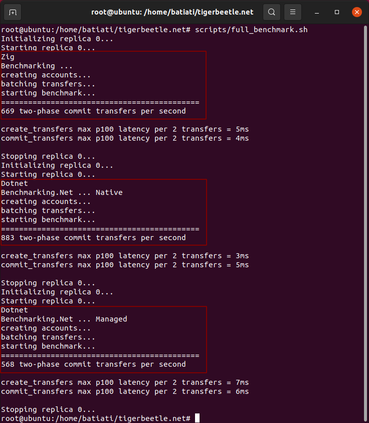

# TigerBeetle.Net

A C# client for [TigerBeetle](https://github.com/coilhq/tigerbeetle)

**[Compatible with .Net Standard 2.1](https://docs.microsoft.com/en-us/dotnet/standard/net-standard)**

*TigerBeetle is a financial accounting database designed for mission-critical safety and performance to power the future of financial services.*

Watch an introduction to TigerBeetle on [Zig SHOWTIME](https://www.youtube.com/watch?v=BH2jvJ74npM) for more details:

[](https://www.youtube.com/watch?v=BH2jvJ74npM)

# Motivation

*This project is a work in progress (WIP)*

- Learn more about TigerBettle's architecture, by studying its source code.

- Learn more about new features introduced in dotNet, like slices, ranges, and buffers.

# Native and managed client

This project offers two client backends: **native** or **managed**.

- The **native client backend** is a library binding to the original [client.zig](https://github.com/coilhq/tigerbeetle/blob/main/src/vsr/client.zig) implementation. It shows pair performance with the Zig benchmark, without additional memory copies or marshaling overhead.

See the experimental [libtigerbeetle implementation](src/libtigerbeetle/src/lib.zig) for more details about the binding interface.


- The **managed client backend** is a pure C# implementation based on the same principles regarding performance and memory efficiency adopted by TigerBeetle. In many places, this C# version is just a line-by-line port of the Zig code. 

# Installing

1. Clone this repo

> ```bash
> $ git clone --recurse-submodules https://github.com/batiati/tigerbeetle.net
> $ cd tigerbeetle.net
> ```

2. Chmod the scripts

> ```bash
> $ chmod +x scripts/*.sh
> ```

3. Install [Zig](https://ziglang.org/)

> ```bash
> $ scripts/install_zig.sh
> ```

4. Install [DotNet](https://docs.microsoft.com/en-us/dotnet/)

> ```
> $ scripts/install_dotnet.sh
> ```

# Benchmarking

Run the `benchmark.sh` script passing `zig`, `native` or `managed` as argument to run each version of the benchmark.


```bash
$ scripts/benchmark.sh native
```

Or run the full benchmark to run all three versions in a row.


```bash
$ scripts/full_benchmark.sh
```

### 1. One million transactions, 5.000 per batch

The C# benchmark using _native client_ has pair performance with the original _tigerbeetle benchmark_, outperforming it sometimes.

The  _managed client_ runs about 40~50% slower than the original _tigerbeetle benchmark_, using default parameters.

```
MAX_TRANSFERS = 1_000_000;
IS_TWO_PHASE_COMMIT = false;
BATCH_SIZE = 5_000;
```

> 

### 2. Half million transactions, 1.000 per batch

The C# benchmark using _native client_ outperforms the original _tigerbeetle benchmark_, probably due differences between the thread models. The zig benchmark calls `tick()` from the main thread and the C# benchmark uses async/await with a background thread ticking.

The _managed client_ performs better with smaller batches, but still presents high latency.

```
MAX_TRANSFERS = 500_000;
IS_TWO_PHASE_COMMIT = false;
BATCH_SIZE = 1000;
```

> 

### 3. Two-phase transactions, only 2 per batch

The C# benchmark using _native client_ outperforms the original _tigerbeetle benchmark_ in this scenario too. We need to investigate this ...

The _managed client_ came pretty close with only 2 transactions per batch, with acceptable latency.

```
MAX_TRANSFERS = 1_000;
IS_TWO_PHASE_COMMIT = true;
BATCH_SIZE = 2;
```

> 

### 5. Profiling the native client

> ### TODO

### 4. Profiling the managed client

The profiler shows most of the time spent on waiting for IO operations.


TigerBeetle uses `io_uring`, and we use whatever the DotNet SDK implementation does. [Maybe in future releases, DotNet will support `io_uring`](https://github.com/dotnet/runtime/issues/51985)

### 5. Compatibility

The native client can only run on the same platforms supported by TigerBeetle, currently Linux > 5.1 and OSX (Windows support is planned).

The managed client can run on environments where native code isn't compatible or allowed, like Windows and old Linux distributions.

## TODO List

- [X] Benchmarks scripts.
- [ ] Build and embeed the native library.
- [ ] Error handling and reconnection for the managed client.
- [ ] More tests
- [ ] Code cleanup

## License

Licensed under the Apache License, Version 2.0 (the "License"); you may not use these files except in compliance with the License. You may obtain a copy of the License at

https://www.apache.org/licenses/LICENSE-2.0

Unless required by applicable law or agreed to in writing, software distributed under the License is distributed on an "AS IS" BASIS, WITHOUT WARRANTIES OR CONDITIONS OF ANY KIND, either express or implied. See the License for the specific language governing permissions and limitations under the License.
